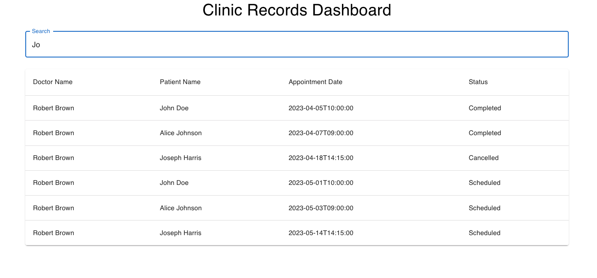

# Healthcare demo
Healthcare database data model with federation used for SE demos

## How to Use
1. Run `docker compose up -d` to start the necessary containers
2. Open [this HGE instance](http://localhost:8021/console/data/sql) and paste then execute the `data-init`/`clinic_data.sql` script to seed the data
3. Import the `hge-metadata-<app_name>.json` files into each HGE app
4. Run `npm install` to install frontend dependencies from `package.json` file
5. Run `npm start` to run the React frontend
6. Access the [main HGE app ](http://localhost:8020/console`) -- this Hasura app federates over all the separate services

The healthcare federation demo is comprised of the following services:
- hge-doctors: providing a GrapQL API for the `doctors` table, in the clinic_data database
- hge-patients: providing a GrapQL API for the `patients` table, in the clinic_data database
- hge-appts: providing a GrapQL API for the `appts` table, in the clinic_data database
- hge-records: providing a GrapQL API for the `records` table, in the clinic_data database
- hge-main: providing a federated GrapQL API for:
    - the `hge-doctors` GraphQL sub-graph (via Remote Schemas)
    - the `hge-patients` GraphQL sub-graph (via Remote Schemas)
    - the `hge-appts` GraphQL sub-graph (via Remote Schemas)
    - the `hge-records` GraphQL sub-graph (via Remote Schemas)
    - Remote Schemas-to-Remote Schema joins (via relationships)

